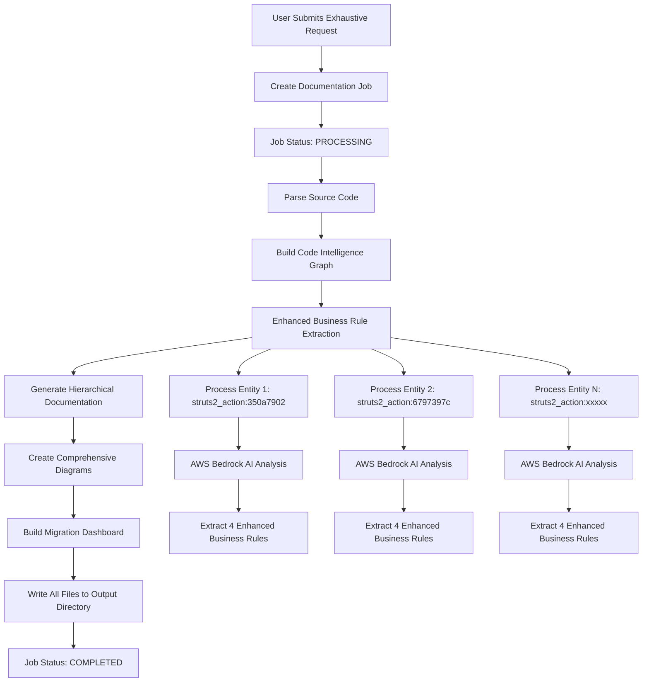
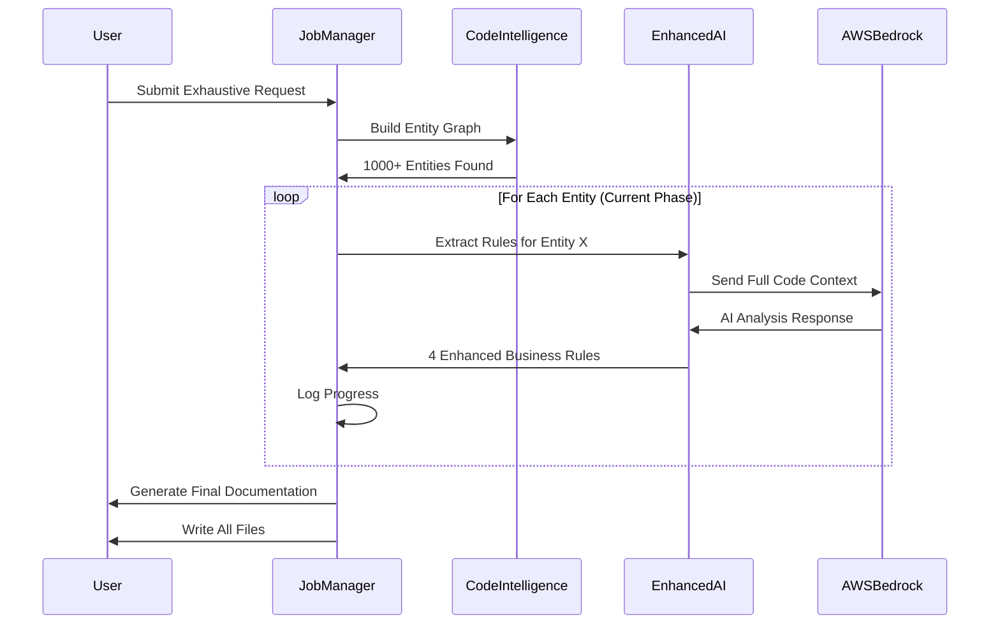
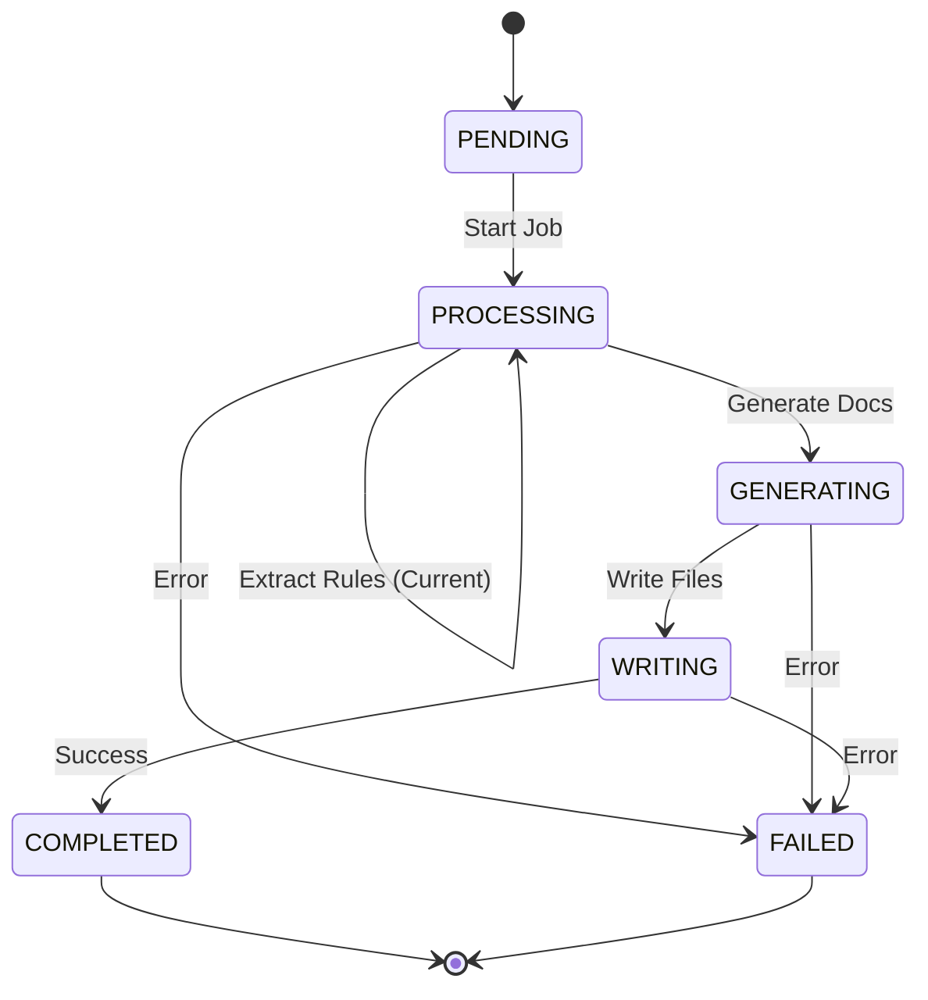

# 🏗️ Documentation Generation System Flow

## 📊 Overall Architecture

## 🔄 Current Phase: Enhanced Business Rule Extraction

**You are currently in Phase F** - the most time-intensive part of exhaustive documentation:

## ⏱️ Phase Breakdown

| Phase | Status | Description | Duration | Files Written |
|-------|--------|-------------|----------|---------------|
| 1. Code Parsing | ✅ Complete | Parse source files | ~2 min | None |
| 2. Intelligence Graph | ✅ Complete | Build relationships | ~3 min | None |
| **3. Business Rules** | 🔄 **CURRENT** | **Extract with full context** | **20-60 min** | **None** |
| 4. Documentation Gen | ⏳ Pending | Generate comprehensive docs | ~10 min | None |
| 5. Diagram Creation | ⏳ Pending | 15+ enterprise diagrams | ~15 min | None |
| 6. File Writing | ⏳ Pending | **ALL FILES WRITTEN HERE** | ~2 min | **📁 ALL** |

## 🎯 Why No Files Yet?

**Files are written at the very end** to ensure:
- All analysis is complete
- All cross-references are resolved  
- All diagrams are generated
- Complete consistency across all documentation

## 📋 Job Management System

## 🔍 Current Progress Indicators

Your logs show **healthy progress**:
- ✅ Regular business rule extraction (every 2-4 minutes)
- ✅ AWS Bedrock connections stable
- ✅ No error messages
- ✅ System responsive (200 OK responses)
- ✅ Processing Struts2 entities systematically

## 🚀 Expected Timeline

**Based on your current rate:**
- Processing ~1 entity every 2-4 minutes
- If you have ~100 entities → 3-6 hours total
- If you have ~50 entities → 2-3 hours total  
- If you have ~20 entities → 1 hour total

The exhaustive mode is **designed to be thorough, not fast**.