# DocXP Enterprise Workflow Documentation

This document provides comprehensive workflow diagrams and operational procedures for the DocXP Enterprise Conversational Code Decomposition Platform.

## Table of Contents

1. [User Journey Workflows](#user-journey-workflows)
2. [System Integration Patterns](#system-integration-patterns)
3. [Data Processing Workflows](#data-processing-workflows)
4. [AI Agent Orchestration](#ai-agent-orchestration)
5. [Error Handling and Recovery](#error-handling-and-recovery)
6. [Performance Optimization Workflows](#performance-optimization-workflows)

## User Journey Workflows

### Repository Onboarding Workflow

### Conversational Code Exploration

## System Integration Patterns

### Multi-Repository Enterprise Coordination

```mermaid
flowchart TB
    subgraph "Enterprise Repository Ecosystem"
        direction TB
        REPO1[Legacy Java Application<br/>🏛️ Core Business Logic]
        REPO2[Modern React Frontend<br/>⚛️ User Interface]
        REPO3[Python Microservices<br/>🐍 API Services]
        REPO4[Database Scripts<br/>🗄️ Schema & Migrations]
        REPO5[Infrastructure Code<br/>⚙️ DevOps & Config]
    end
    
    subgraph "DocXP Coordination Layer"
        direction TB
        PROJECT_COORD[Project Coordinator<br/>🎯 Multi-repo orchestration]
        DEPENDENCY_MAP[Dependency Mapper<br/>🔗 Cross-repo relationships]
        IMPACT_ANALYZER[Impact Analyzer<br/>📊 Change propagation]
        UNIFIED_SEARCH[Unified Search<br/>🔍 Cross-repo queries]
    end
    
    subgraph "Analysis Pipeline"
        direction LR
        BATCH_PROCESSOR[Batch Processor<br/>⚡ Concurrent analysis]
        CONFLICT_RESOLVER[Conflict Resolver<br/>🔧 Dependency conflicts]
        SYNC_MANAGER[Sync Manager<br/>🔄 State synchronization]
    end
    
    subgraph "Intelligence Layer"
        direction TB
        KNOWLEDGE_GRAPH[Unified Knowledge Graph<br/>🧠 Enterprise intelligence]
        PATTERN_LIBRARY[Pattern Library<br/>📚 Architectural patterns]
        BEST_PRACTICES[Best Practices DB<br/>✅ Recommendations]
    end
    
    %% Repository connections
    REPO1 --> PROJECT_COORD
    REPO2 --> PROJECT_COORD
    REPO3 --> PROJECT_COORD
    REPO4 --> PROJECT_COORD
    REPO5 --> PROJECT_COORD
    
    %% Coordination layer processing
    PROJECT_COORD --> DEPENDENCY_MAP
    PROJECT_COORD --> IMPACT_ANALYZER
    PROJECT_COORD --> UNIFIED_SEARCH
    
    %% Analysis pipeline
    DEPENDENCY_MAP --> BATCH_PROCESSOR
    IMPACT_ANALYZER --> CONFLICT_RESOLVER
    UNIFIED_SEARCH --> SYNC_MANAGER
    
    %% Intelligence layer integration
    BATCH_PROCESSOR --> KNOWLEDGE_GRAPH
    CONFLICT_RESOLVER --> PATTERN_LIBRARY
    SYNC_MANAGER --> BEST_PRACTICES
    
    %% Cross-connections for intelligence
    KNOWLEDGE_GRAPH -.-> DEPENDENCY_MAP
    PATTERN_LIBRARY -.-> IMPACT_ANALYZER
    BEST_PRACTICES -.-> UNIFIED_SEARCH
    
    classDef repo fill:#e3f2fd,stroke:#1976d2,stroke-width:2px
    classDef coord fill:#f3e5f5,stroke:#7b1fa2,stroke-width:2px
    classDef pipeline fill:#fff3e0,stroke:#f57c00,stroke-width:2px
    classDef intelligence fill:#e8f5e8,stroke:#388e3c,stroke-width:2px
    
    class REPO1,REPO2,REPO3,REPO4,REPO5 repo
    class PROJECT_COORD,DEPENDENCY_MAP,IMPACT_ANALYZER,UNIFIED_SEARCH coord
    class BATCH_PROCESSOR,CONFLICT_RESOLVER,SYNC_MANAGER pipeline
    class KNOWLEDGE_GRAPH,PATTERN_LIBRARY,BEST_PRACTICES intelligence
```

### Real-time Synchronization Pattern

## Data Processing Workflows

### Intelligent File Processing Pipeline

```mermaid
flowchart TD
    subgraph "Input Processing"
        FILE_INTAKE[File Intake<br/>📁 Repository scanning]
        FILE_CLASSIFICATION[File Classification<br/>🔍 Language detection]
        BATCH_FORMATION[Batch Formation<br/>📦 Optimal grouping]
    end
    
    subgraph "Language-Specific Analysis"
        direction TB
        JAVA_ANALYSIS[Java Analysis<br/>☕ Classes, methods, dependencies]
        PYTHON_ANALYSIS[Python Analysis<br/>🐍 Modules, functions, imports]
        JS_ANALYSIS[JavaScript Analysis<br/>📜 Functions, modules, components]
        SQL_ANALYSIS[SQL Analysis<br/>🗄️ Tables, procedures, queries]
        CONFIG_ANALYSIS[Config Analysis<br/>⚙️ Properties, environments]
    end
    
    subgraph "AI-Powered Enhancement"
        direction LR
        PATTERN_DETECTION[Pattern Detection<br/>🔍 Design patterns, anti-patterns]
        BUSINESS_RULES[Business Rule Extraction<br/>📋 Logic identification]
        SEMANTIC_ANALYSIS[Semantic Analysis<br/>🧠 Meaning extraction]
        QUALITY_ASSESSMENT[Quality Assessment<br/>📊 Technical debt analysis]
    end
    
    subgraph "Knowledge Integration"
        direction TB
        ENTITY_LINKING[Entity Linking<br/>🔗 Connect related concepts]
        FLOW_CONSTRUCTION[Flow Construction<br/>🔄 End-to-end tracing]
        GRAPH_BUILDING[Graph Building<br/>🕸️ Relationship modeling]
        VECTOR_INDEXING[Vector Indexing<br/>📊 Semantic embedding]
    end
    
    subgraph "Quality Assurance"
        VALIDATION[Result Validation<br/>✅ Quality checks]
        CONSISTENCY[Consistency Verification<br/>🔍 Cross-reference validation]
        COMPLETENESS[Completeness Assessment<br/>📈 Coverage analysis]
    end
    
    %% Processing flow
    FILE_INTAKE --> FILE_CLASSIFICATION
    FILE_CLASSIFICATION --> BATCH_FORMATION
    
    BATCH_FORMATION --> JAVA_ANALYSIS
    BATCH_FORMATION --> PYTHON_ANALYSIS
    BATCH_FORMATION --> JS_ANALYSIS
    BATCH_FORMATION --> SQL_ANALYSIS
    BATCH_FORMATION --> CONFIG_ANALYSIS
    
    JAVA_ANALYSIS --> PATTERN_DETECTION
    PYTHON_ANALYSIS --> BUSINESS_RULES
    JS_ANALYSIS --> SEMANTIC_ANALYSIS
    SQL_ANALYSIS --> QUALITY_ASSESSMENT
    CONFIG_ANALYSIS --> PATTERN_DETECTION
    
    PATTERN_DETECTION --> ENTITY_LINKING
    BUSINESS_RULES --> FLOW_CONSTRUCTION
    SEMANTIC_ANALYSIS --> GRAPH_BUILDING
    QUALITY_ASSESSMENT --> VECTOR_INDEXING
    
    ENTITY_LINKING --> VALIDATION
    FLOW_CONSTRUCTION --> CONSISTENCY
    GRAPH_BUILDING --> COMPLETENESS
    VECTOR_INDEXING --> VALIDATION
    
    VALIDATION --> OUTPUT[📤 Structured Output]
    CONSISTENCY --> OUTPUT
    COMPLETENESS --> OUTPUT
    
    classDef input fill:#e1f5fe,stroke:#0277bd,stroke-width:2px
    classDef analysis fill:#f3e5f5,stroke:#7b1fa2,stroke-width:2px
    classDef ai fill:#fff3e0,stroke:#ef6c00,stroke-width:2px
    classDef integration fill:#e8f5e8,stroke:#2e7d32,stroke-width:2px
    classDef qa fill:#fce4ec,stroke:#c2185b,stroke-width:2px
    classDef output fill:#f1f8e9,stroke:#558b2f,stroke-width:2px
    
    class FILE_INTAKE,FILE_CLASSIFICATION,BATCH_FORMATION input
    class JAVA_ANALYSIS,PYTHON_ANALYSIS,JS_ANALYSIS,SQL_ANALYSIS,CONFIG_ANALYSIS analysis
    class PATTERN_DETECTION,BUSINESS_RULES,SEMANTIC_ANALYSIS,QUALITY_ASSESSMENT ai
    class ENTITY_LINKING,FLOW_CONSTRUCTION,GRAPH_BUILDING,VECTOR_INDEXING integration
    class VALIDATION,CONSISTENCY,COMPLETENESS qa
    class OUTPUT output
```

## AI Agent Orchestration

### Strands Agent Workflow

### Multi-Agent Coordination

## Error Handling and Recovery

### Comprehensive Error Management Workflow

```mermaid
flowchart TD
    subgraph "Error Detection"
        MONITOR[Continuous Monitoring<br/>👁️ System health checks]
        THRESHOLD[Threshold Detection<br/>⚠️ Performance metrics]
        EXCEPTION[Exception Capture<br/>🚨 Runtime errors]
        VALIDATION[Validation Failures<br/>❌ Data quality issues]
    end
    
    subgraph "Error Classification"
        CATEGORIZE[Error Categorization<br/>🏷️ Type classification]
        SEVERITY[Severity Assessment<br/>📊 Impact analysis]
        CONTEXT[Context Gathering<br/>🔍 Environmental factors]
    end
    
    subgraph "Recovery Strategies"
        direction TB
        RETRY[Automatic Retry<br/>🔄 Transient errors]
        FALLBACK[Graceful Fallback<br/>🛟 Alternative processing]
        ISOLATION[Error Isolation<br/>🚧 Contain impact]
        ESCALATION[Human Escalation<br/>👨‍💻 Manual intervention]
    end
    
    subgraph "Recovery Actions"
        direction LR
        SERVICE_RESTART[Service Restart<br/>🔄 Process recovery]
        CACHE_CLEAR[Cache Invalidation<br/>🗑️ Clear stale data]
        CONNECTION_RESET[Connection Reset<br/>🔌 Re-establish links]
        ROLLBACK[Data Rollback<br/>↩️ Restore previous state]
    end
    
    subgraph "Monitoring & Learning"
        LOG[Error Logging<br/>📝 Detailed recording]
        METRICS[Metrics Collection<br/>📈 Performance tracking]
        ANALYSIS[Pattern Analysis<br/>🔍 Trend identification]
        IMPROVEMENT[Process Improvement<br/>⚡ System optimization]
    end
    
    %% Error flow
    MONITOR --> CATEGORIZE
    THRESHOLD --> CATEGORIZE
    EXCEPTION --> CATEGORIZE
    VALIDATION --> CATEGORIZE
    
    CATEGORIZE --> SEVERITY
    SEVERITY --> CONTEXT
    
    CONTEXT --> RETRY
    CONTEXT --> FALLBACK  
    CONTEXT --> ISOLATION
    CONTEXT --> ESCALATION
    
    RETRY --> SERVICE_RESTART
    FALLBACK --> CACHE_CLEAR
    ISOLATION --> CONNECTION_RESET
    ESCALATION --> ROLLBACK
    
    SERVICE_RESTART --> LOG
    CACHE_CLEAR --> METRICS
    CONNECTION_RESET --> ANALYSIS
    ROLLBACK --> IMPROVEMENT
    
    LOG --> MONITOR
    METRICS --> THRESHOLD
    ANALYSIS --> EXCEPTION
    IMPROVEMENT --> VALIDATION
    
    classDef detection fill:#ffebee,stroke:#c62828,stroke-width:2px
    classDef classification fill:#fff3e0,stroke:#ef6c00,stroke-width:2px
    classDef strategy fill:#e8f5e8,stroke:#2e7d32,stroke-width:2px
    classDef action fill:#e3f2fd,stroke:#1565c0,stroke-width:2px
    classDef learning fill:#f3e5f5,stroke:#6a1b9a,stroke-width:2px
    
    class MONITOR,THRESHOLD,EXCEPTION,VALIDATION detection
    class CATEGORIZE,SEVERITY,CONTEXT classification
    class RETRY,FALLBACK,ISOLATION,ESCALATION strategy
    class SERVICE_RESTART,CACHE_CLEAR,CONNECTION_RESET,ROLLBACK action
    class LOG,METRICS,ANALYSIS,IMPROVEMENT learning
```

## Performance Optimization Workflows

### Adaptive Performance Tuning

```mermaid
graph TB
    subgraph "Performance Monitoring"
        CPU_MONITOR[CPU Usage Monitor<br/>📊 Real-time tracking]
        MEMORY_MONITOR[Memory Usage Monitor<br/>🧠 Memory profiling]
        IO_MONITOR[I/O Performance Monitor<br/>💾 Disk & network I/O]
        QUERY_MONITOR[Query Performance Monitor<br/>🔍 Database performance]
    end
    
    subgraph "Bottleneck Detection"
        ANALYZE_CPU[CPU Bottleneck Analysis<br/>⚡ Processing constraints]
        ANALYZE_MEMORY[Memory Bottleneck Analysis<br/>🧠 Memory constraints]
        ANALYZE_IO[I/O Bottleneck Analysis<br/>💾 Storage constraints]
        ANALYZE_NETWORK[Network Bottleneck Analysis<br/>🌐 Bandwidth constraints]
    end
    
    subgraph "Optimization Strategies"
        direction TB
        CACHING[Intelligent Caching<br/>⚡ Redis optimization]
        BATCHING[Batch Processing<br/>📦 Efficient data handling]
        INDEXING[Query Optimization<br/>🔍 Database indexing]
        PARALLELIZATION[Parallel Processing<br/>⚙️ Multi-threading]
        COMPRESSION[Data Compression<br/>🗜️ Storage optimization]
    end
    
    subgraph "Implementation"
        CONFIG_UPDATE[Configuration Updates<br/>⚙️ System tuning]
        SCHEMA_OPTIMIZE[Schema Optimization<br/>🗄️ Database tuning]
        CODE_OPTIMIZE[Code Optimization<br/>💻 Algorithm improvement]
        RESOURCE_SCALE[Resource Scaling<br/>📈 Capacity adjustment]
    end
    
    subgraph "Validation"
        PERFORMANCE_TEST[Performance Testing<br/>🧪 Benchmark validation]
        LOAD_TEST[Load Testing<br/>📊 Stress testing]
        MONITOR_IMPACT[Impact Monitoring<br/>👁️ Change assessment]
    end
    
    %% Monitoring to detection
    CPU_MONITOR --> ANALYZE_CPU
    MEMORY_MONITOR --> ANALYZE_MEMORY
    IO_MONITOR --> ANALYZE_IO
    QUERY_MONITOR --> ANALYZE_NETWORK
    
    %% Detection to strategies
    ANALYZE_CPU --> CACHING
    ANALYZE_CPU --> PARALLELIZATION
    ANALYZE_MEMORY --> COMPRESSION
    ANALYZE_MEMORY --> BATCHING
    ANALYZE_IO --> INDEXING
    ANALYZE_IO --> CACHING
    ANALYZE_NETWORK --> COMPRESSION
    ANALYZE_NETWORK --> BATCHING
    
    %% Strategies to implementation
    CACHING --> CONFIG_UPDATE
    BATCHING --> SCHEMA_OPTIMIZE
    INDEXING --> SCHEMA_OPTIMIZE
    PARALLELIZATION --> CODE_OPTIMIZE
    COMPRESSION --> RESOURCE_SCALE
    
    %% Implementation to validation
    CONFIG_UPDATE --> PERFORMANCE_TEST
    SCHEMA_OPTIMIZE --> LOAD_TEST
    CODE_OPTIMIZE --> MONITOR_IMPACT
    RESOURCE_SCALE --> PERFORMANCE_TEST
    
    %% Feedback loop
    PERFORMANCE_TEST --> CPU_MONITOR
    LOAD_TEST --> MEMORY_MONITOR
    MONITOR_IMPACT --> IO_MONITOR
    
    classDef monitoring fill:#e1f5fe,stroke:#0277bd,stroke-width:2px
    classDef detection fill:#fff3e0,stroke:#ef6c00,stroke-width:2px
    classDef strategy fill:#e8f5e8,stroke:#2e7d32,stroke-width:2px
    classDef implementation fill:#f3e5f5,stroke:#7b1fa2,stroke-width:2px
    classDef validation fill:#fce4ec,stroke:#c2185b,stroke-width:2px
    
    class CPU_MONITOR,MEMORY_MONITOR,IO_MONITOR,QUERY_MONITOR monitoring
    class ANALYZE_CPU,ANALYZE_MEMORY,ANALYZE_IO,ANALYZE_NETWORK detection
    class CACHING,BATCHING,INDEXING,PARALLELIZATION,COMPRESSION strategy
    class CONFIG_UPDATE,SCHEMA_OPTIMIZE,CODE_OPTIMIZE,RESOURCE_SCALE implementation
    class PERFORMANCE_TEST,LOAD_TEST,MONITOR_IMPACT validation
```

### Scalability Planning Workflow

---

## Workflow Integration Points

### Cross-System Communication Patterns

1. **Synchronous Communication**
   - REST API calls for immediate responses
   - GraphQL for complex data queries
   - gRPC for high-performance service communication

2. **Asynchronous Communication**
   - Redis pub/sub for real-time updates
   - Message queues for background processing
   - WebSockets for live frontend updates

3. **Data Consistency Patterns**
   - ACID transactions for critical operations
   - Eventual consistency for distributed updates
   - SAGA pattern for complex workflows

4. **Monitoring and Observability**
   - Distributed tracing across services
   - Centralized logging with structured data
   - Metrics collection and alerting

## Performance Benchmarks

| Workflow | Small Repo (<1K files) | Medium Repo (1K-10K files) | Large Repo (>10K files) |
|----------|------------------------|----------------------------|--------------------------|
| Initial Analysis | 2-5 minutes | 10-30 minutes | 1-3 hours |
| Incremental Update | 30 seconds | 2-5 minutes | 10-20 minutes |
| Search Query | <100ms | <200ms | <500ms |
| Knowledge Graph Query | <50ms | <100ms | <200ms |
| AI-powered Insight | 1-3 seconds | 3-5 seconds | 5-10 seconds |

---

**Last Updated**: January 2025  
**Version**: 1.0.0  
**Maintained by**: DocXP Architecture Team

This workflow documentation provides the operational foundation for understanding and optimizing DocXP enterprise deployments across various scales and use cases.