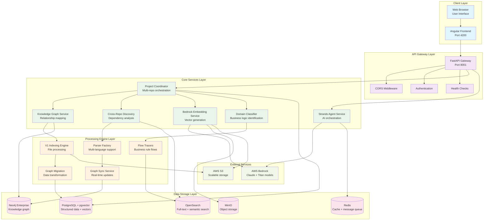
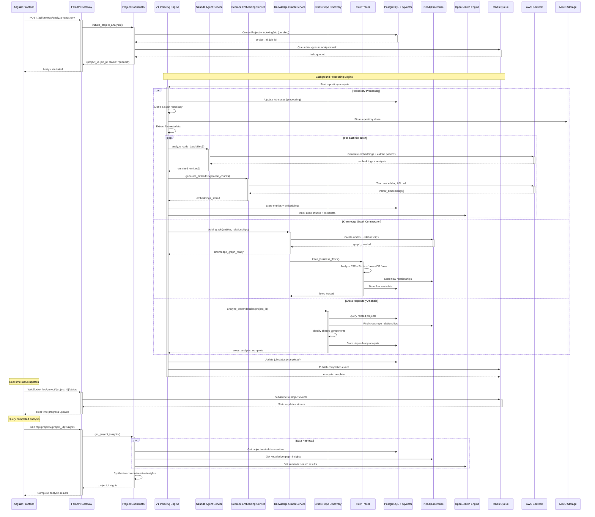
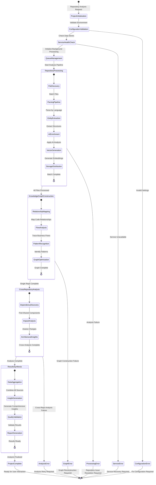

# DocXP Enterprise Architecture Documentation

## Enterprise Stack Architecture Overview


## Enterprise Service Interaction Map



## Enterprise Repository Analysis Workflow



## Enterprise Processing Pipeline Flow

```mermaid
flowchart TD
    Start([Repository Analysis Request]) --> ProjectInit[Initialize Project Context]
    ProjectInit --> ValidateAccess{AWS Bedrock<br/>& Services Available?}
    
    ValidateAccess -->|No| ConfigError["❌ Configuration Error<br/>Check AWS credentials & services"]
    ValidateAccess -->|Yes| CreateProject["📊 Create Project Entry<br/>PostgreSQL"]
    
    CreateProject --> QueueJob["🔄 Queue Analysis Job<br/>Redis"]
    QueueJob --> RepoValidation{Repository<br/>Accessible?}
    
    RepoValidation -->|No| RepoError["❌ Repository Error<br/>Invalid path or permissions"]
    RepoValidation -->|Yes| CloneRepo["📥 Clone Repository<br/>MinIO Storage"]
    
    CloneRepo --> ScanStructure["🔍 Scan Repository Structure<br/>File discovery & classification"]
    
    ScanStructure --> ProcessingChoice{Processing<br/>Strategy}
    
    ProcessingChoice -->|Small Repo| SingleThreaded[Single-threaded Processing]
    ProcessingChoice -->|Large Repo| MultiThreaded["⚡ Multi-threaded Processing<br/>Batch processing"]
    
    SingleThreaded --> FileAnalysis
    MultiThreaded --> FileAnalysis["📝 File Analysis Pipeline"]
    
    FileAnalysis --> ParserSelection{"Select Parser<br/>by File Type"}
    
    ParserSelection -->|Java| JavaParser["☕ Java Parser<br/>Classes, methods, dependencies"]
    ParserSelection -->|Python| PythonParser["🐍 Python Parser<br/>Modules, functions, imports"]
    ParserSelection -->|JSP/Struts| WebParser["🌐 Web Framework Parser<br/>Actions, forms, flows"]
    ParserSelection -->|TypeScript| TSParser["📜 TypeScript Parser<br/>Components, services"]
    ParserSelection -->|Generic| GenericParser["📄 Generic Text Parser<br/>Basic structure"]
    
    JavaParser --> EntityExtraction
    PythonParser --> EntityExtraction
    WebParser --> EntityExtraction
    TSParser --> EntityExtraction
    GenericParser --> EntityExtraction["🎯 Entity Extraction<br/>Code structures & relationships"]
    
    EntityExtraction --> AIEnrichment["🤖 AI-Powered Analysis<br/>Strands Agents + AWS Bedrock"]
    
    AIEnrichment --> AITasks{
"AI Analysis Tasks"}
    
    AITasks -->|Patterns| PatternAnalysis["🔍 Pattern Recognition<br/>Design patterns & anti-patterns"]
    AITasks -->|Rules| BusinessRules["📋 Business Rule Extraction<br/>Logic identification"]
    AITasks -->|Flows| FlowTracing["🔄 Flow Tracing<br/>Cross-technology paths"]
    AITasks -->|Embeddings| VectorGeneration["📊 Vector Generation<br/>Semantic embeddings"]
    
    PatternAnalysis --> StoreResults
    BusinessRules --> StoreResults
    FlowTracing --> StoreResults
    VectorGeneration --> StoreResults["💾 Store Analysis Results"]
    
    StoreResults --> DataStorage{"Multi-store<br/>Data Persistence"}
    
    DataStorage -->|Structured Data| PostgreSQLStore["🗄️ PostgreSQL<br/>Entities, metadata, vectors"]
    DataStorage -->|Graph Data| Neo4jStore["🕸️ Neo4j<br/>Relationships, flows"]
    DataStorage -->|Search Index| OpenSearchStore["🔍 OpenSearch<br/>Full-text, semantic search"]
    DataStorage -->|Cache Data| RedisStore["⚡ Redis<br/>Session cache, job status"]
    
    PostgreSQLStore --> KnowledgeGraph
    Neo4jStore --> KnowledgeGraph
    OpenSearchStore --> KnowledgeGraph
    RedisStore --> KnowledgeGraph["🧠 Knowledge Graph Construction<br/>Unified intelligence layer"]
    
    KnowledgeGraph --> CrossRepoAnalysis{"Multi-repository<br/>Project?"}
    
    CrossRepoAnalysis -->|Yes| DiscoveryService["🔗 Cross-Repo Discovery<br/>Dependency analysis"]
    CrossRepoAnalysis -->|No| FinalValidation
    
    DiscoveryService --> DependencyMapping["📈 Dependency Mapping<br/>Inter-project relationships"]
    DependencyMapping --> FinalValidation["✅ Final Validation<br/>Quality checks"]
    
    FinalValidation --> ValidationPassed{"All Validations<br/>Passed?"}
    
    ValidationPassed -->|Yes| Success["🎉 Analysis Complete<br/>Results available"]
    ValidationPassed -->|No| PartialSuccess["⚠️ Partial Success<br/>Some issues found"]
    
    Success --> NotifyComplete
    PartialSuccess --> NotifyComplete["📢 Notify Completion<br/>Update project status"]
    
    NotifyComplete --> WebSocketUpdate["🔄 Real-time Updates<br/>Frontend notification"]
    WebSocketUpdate --> End(["📊 Analysis Available<br/>Ready for exploration"])
    
    %% Error handling paths
    ConfigError --> End
    RepoError --> End
    
    %% Styling
    classDef startEnd fill:#e8f5e8,stroke:#4caf50,stroke-width:2px
    classDef process fill:#e3f2fd,stroke:#2196f3,stroke-width:2px
    classDef decision fill:#fff3e0,stroke:#ff9800,stroke-width:2px
    classDef error fill:#ffebee,stroke:#f44336,stroke-width:2px
    classDef success fill:#e8f5e8,stroke:#4caf50,stroke-width:2px
    classDef storage fill:#f3e5f5,stroke:#9c27b0,stroke-width:2px
    
    class Start,End startEnd
    class ProjectInit,CreateProject,QueueJob,CloneRepo,ScanStructure,FileAnalysis,EntityExtraction,AIEnrichment,StoreResults,KnowledgeGraph,DiscoveryService,DependencyMapping,FinalValidation,NotifyComplete,WebSocketUpdate process
    class ValidateAccess,RepoValidation,ProcessingChoice,ParserSelection,AITasks,DataStorage,CrossRepoAnalysis,ValidationPassed decision
    class ConfigError,RepoError error
    class Success,PartialSuccess success
    class PostgreSQLStore,Neo4jStore,OpenSearchStore,RedisStore storage
```

## Enterprise Service Dependency Matrix

```mermaid
flowchart TB
    subgraph "Frontend Tier"
        direction TB
        ANGULAR["Angular SPA<br/>📱 User Interface"]
        NGINX["Nginx Proxy<br/>🌐 Load Balancer"]
    end
    
    subgraph "API Gateway Tier"
        direction TB
        FASTAPI["FastAPI Gateway<br/>🚪 Request Router"]
        MIDDLEWARE["Security Middleware<br/>🔒 CORS, Auth, Rate Limiting"]
        HEALTH_API["Health Check API<br/>💓 System Monitoring"]
        SWAGGER["OpenAPI Docs<br/>📚 Interactive Documentation"]
    end
    
    subgraph "Core Service Tier"
        direction TB
        PROJECT_COORD["Project Coordinator<br/>🎯 Multi-repo Orchestration"]
        KNOWLEDGE_SVC["Knowledge Graph Service<br/>🧠 Relationship Intelligence"]
        STRANDS_AGENT["Strands Agent Service<br/>🤖 AI Agent Orchestration"]
        BEDROCK_SVC["Bedrock Embedding Service<br/>📊 Vector Generation"]
        CROSS_DISCOVERY["Cross-Repo Discovery<br/>🔗 Dependency Analysis"]
        DOMAIN_CLASS["Domain Classifier<br/>📋 Business Logic Identification"]
        GRAPH_SYNC["Graph Sync Service<br/>⚡ Real-time Graph Updates"]
    end
    
    subgraph "Processing Engine Tier"
        direction TB
        V1_INDEXING["V1 Indexing Engine<br/>⚙️ File Processing Pipeline"]
        PARSER_FACTORY["Parser Factory<br/>🔧 Multi-language Analysis"]
        FLOW_TRACER["Flow Tracer<br/>🔄 Business Rule Flows"]
        MIGRATION_SVC["Graph Migration Service<br/>🔄 Data Transformation"]
        ARCHITECTURAL["Architectural Insight Service<br/>🏗️ Pattern Analysis"]
    end
    
    subgraph "Parser Ecosystem"
        direction LR
        JAVA_PARSER["Java Parser<br/>☕"]
        PYTHON_PARSER["Python Parser<br/>🐍"]
        JSP_PARSER["JSP/Struts Parser<br/>🌐"]
        TS_PARSER["TypeScript Parser<br/>📜"]
        GENERIC_PARSER["Generic Parser<br/>📄"]
    end
    
    subgraph "Data Storage Tier"
        direction TB
        POSTGRESQL["PostgreSQL + pgvector<br/>🗄️ Structured Data + Vectors"]
        NEO4J["Neo4j Enterprise<br/>🕸️ Knowledge Graph"]
        OPENSEARCH["OpenSearch Engine<br/>🔍 Full-text + Semantic Search"]
        REDIS["Redis<br/>⚡ Cache + Message Queue"]
        MINIO["MinIO<br/>📦 Object Storage"]
    end
    
    subgraph "External Services Tier"
        direction LR
        AWS_BEDROCK["AWS Bedrock<br/>🧠 Claude + Titan Models"]
        AWS_S3["AWS S3<br/>☁️ Scalable Cloud Storage"]
        VECTOR_DB["Vector Database<br/>📊 High-performance Vectors"]
    end
    
    %% Frontend connections
    NGINX --> ANGULAR
    ANGULAR --> FASTAPI
    
    %% API Gateway internal
    FASTAPI --> MIDDLEWARE
    FASTAPI --> HEALTH_API
    FASTAPI --> SWAGGER
    
    %% API to Core Services
    FASTAPI --> PROJECT_COORD
    FASTAPI --> STRANDS_AGENT
    FASTAPI --> HEALTH_API
    
    %% Core Service Orchestration
    PROJECT_COORD --> KNOWLEDGE_SVC
    PROJECT_COORD --> CROSS_DISCOVERY
    PROJECT_COORD --> BEDROCK_SVC
    PROJECT_COORD --> DOMAIN_CLASS
    
    KNOWLEDGE_SVC --> GRAPH_SYNC
    STRANDS_AGENT --> BEDROCK_SVC
    
    %% Core to Processing Engine
    KNOWLEDGE_SVC --> V1_INDEXING
    CROSS_DISCOVERY --> PARSER_FACTORY
    DOMAIN_CLASS --> FLOW_TRACER
    GRAPH_SYNC --> MIGRATION_SVC
    PROJECT_COORD --> ARCHITECTURAL
    
    %% Processing Engine to Parsers
    PARSER_FACTORY --> JAVA_PARSER
    PARSER_FACTORY --> PYTHON_PARSER
    PARSER_FACTORY --> JSP_PARSER
    PARSER_FACTORY --> TS_PARSER
    PARSER_FACTORY --> GENERIC_PARSER
    
    %% Processing to Data Storage
    V1_INDEXING --> POSTGRESQL
    V1_INDEXING --> OPENSEARCH
    V1_INDEXING --> MINIO
    
    KNOWLEDGE_SVC --> NEO4J
    CROSS_DISCOVERY --> OPENSEARCH
    STRANDS_AGENT --> REDIS
    BEDROCK_SVC --> MINIO
    
    GRAPH_SYNC --> NEO4J
    MIGRATION_SVC --> POSTGRESQL
    FLOW_TRACER --> NEO4J
    ARCHITECTURAL --> POSTGRESQL
    
    %% External Service Connections
    STRANDS_AGENT --> AWS_BEDROCK
    BEDROCK_SVC --> AWS_BEDROCK
    BEDROCK_SVC --> AWS_S3
    V1_INDEXING --> AWS_S3
    OPENSEARCH --> VECTOR_DB
    
    %% Cross-tier communication patterns
    REDIS -.-> PROJECT_COORD
    REDIS -.-> KNOWLEDGE_SVC
    REDIS -.-> V1_INDEXING
    
    NEO4J -.-> CROSS_DISCOVERY
    POSTGRESQL -.-> ARCHITECTURAL
    OPENSEARCH -.-> DOMAIN_CLASS
    
    %% Styling
    classDef frontend fill:#e1f5fe,stroke:#01579b,stroke-width:2px
    classDef api fill:#f3e5f5,stroke:#4a148c,stroke-width:2px
    classDef core fill:#e8f5e8,stroke:#1b5e20,stroke-width:2px
    classDef processing fill:#fff3e0,stroke:#e65100,stroke-width:2px
    classDef parser fill:#fce4ec,stroke:#880e4f,stroke-width:2px
    classDef data fill:#e0f2f1,stroke:#004d40,stroke-width:2px
    classDef external fill:#f1f8e9,stroke:#33691e,stroke-width:2px
    
    class ANGULAR,NGINX frontend
    class FASTAPI,MIDDLEWARE,HEALTH_API,SWAGGER api
    class PROJECT_COORD,KNOWLEDGE_SVC,STRANDS_AGENT,BEDROCK_SVC,CROSS_DISCOVERY,DOMAIN_CLASS,GRAPH_SYNC core
    class V1_INDEXING,PARSER_FACTORY,FLOW_TRACER,MIGRATION_SVC,ARCHITECTURAL processing
    class JAVA_PARSER,PYTHON_PARSER,JSP_PARSER,TS_PARSER,GENERIC_PARSER parser
    class POSTGRESQL,NEO4J,OPENSEARCH,REDIS,MINIO data
    class AWS_BEDROCK,AWS_S3,VECTOR_DB external
```



## Data Flow and State Management

