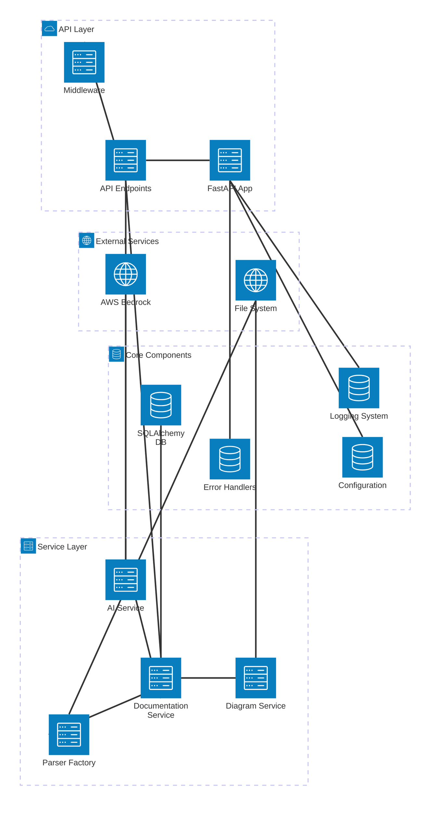
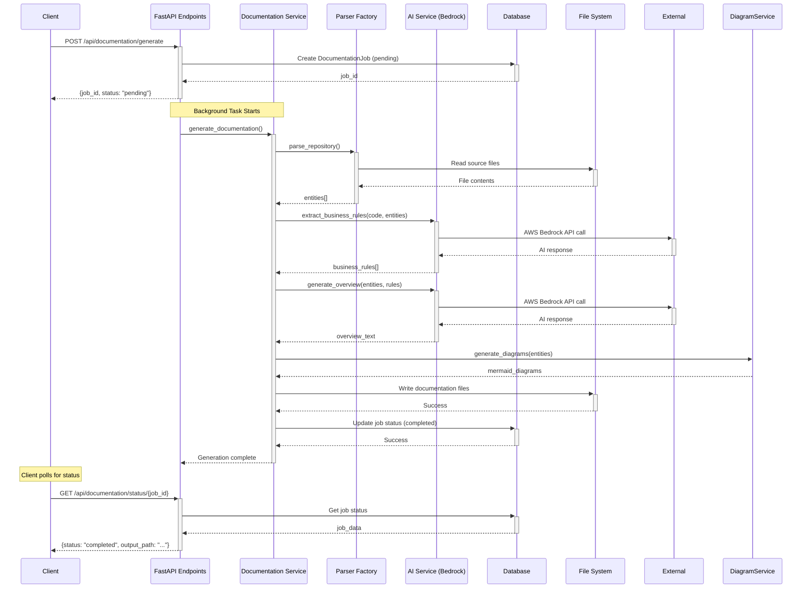
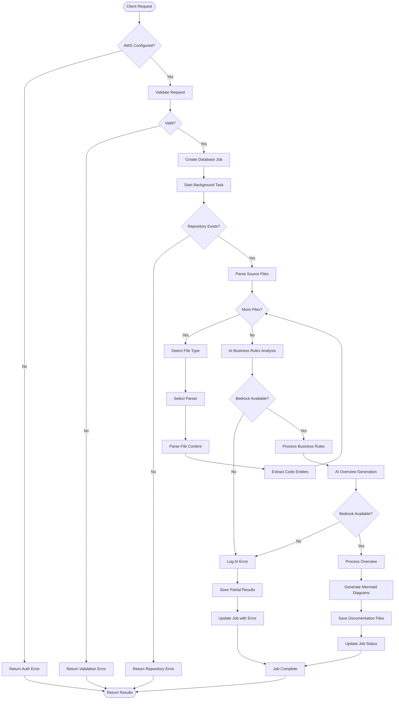
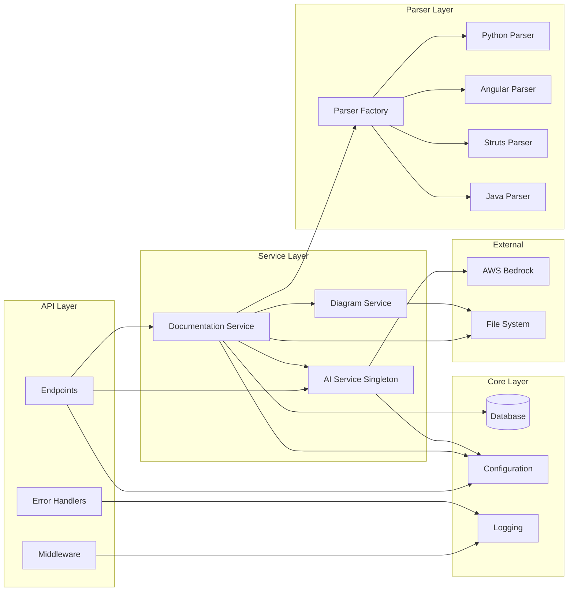

# DocXP Backend Architecture Documentation

## Architecture Diagram

```mermaid
architecture-beta
    group api(cloud)[API Layer]
    group services(server)[Service Layer] 
    group core(database)[Core Components]
    group external(internet)[External Services]

    service fastapi(server)[FastAPI App] in api
    service endpoints(server)[API Endpoints] in api
    service middleware(server)[Middleware] in api

    service docservice(server)[Documentation Service] in services
    service aiservice(server)[AI Service] in services
    service diagramservice(server)[Diagram Service] in services
    service parserfactory(server)[Parser Factory] in services

    service database(database)[SQLAlchemy DB] in core
    service config(database)[Configuration] in core
    service logging(database)[Logging System] in core
    service errors(database)[Error Handlers] in core

    service bedrock(internet)[AWS Bedrock] in external
    service filesystem(internet)[File System] in external

    fastapi:L -- R:endpoints
    endpoints:B -- T:middleware
    
    endpoints:B -- T:docservice
    endpoints:B -- T:aiservice
    
    docservice:R -- L:parserfactory
    docservice:R -- L:diagramservice
    docservice:B -- T:aiservice
    
    aiservice:T -- B:bedrock
    docservice:T -- B:database
    
    parserfactory:T -- B:filesystem
    diagramservice:T -- B:filesystem
    
    fastapi:B -- T:config
    fastapi:B -- T:logging
    fastapi:B -- T:errors
```

## Sequence Diagram - Documentation Generation Flow

```mermaid
sequenceDiagram
    participant Client
    participant API as FastAPI Endpoints
    participant DocService as Documentation Service
    participant Parser as Parser Factory
    participant AI as AI Service (Bedrock)
    participant DB as Database
    participant FS as File System

    Client->>+API: POST /api/documentation/generate
    API->>+DB: Create DocumentationJob (pending)
    DB-->>-API: job_id
    API-->>-Client: {job_id, status: "pending"}
    
    Note over API, DocService: Background Task Starts
    API->>+DocService: generate_documentation()
    
    DocService->>+Parser: parse_repository()
    Parser->>+FS: Read source files
    FS-->>-Parser: File contents
    Parser-->>-DocService: entities[]
    
    DocService->>+AI: extract_business_rules(code, entities)
    AI->>+External: AWS Bedrock API call
    External-->>-AI: AI response
    AI-->>-DocService: business_rules[]
    
    DocService->>+AI: generate_overview(entities, rules)
    AI->>+External: AWS Bedrock API call  
    External-->>-AI: AI response
    AI-->>-DocService: overview_text
    
    DocService->>DiagramService: generate_diagrams(entities)
    DiagramService-->>DocService: mermaid_diagrams
    
    DocService->>+FS: Write documentation files
    FS-->>-DocService: Success
    
    DocService->>+DB: Update job status (completed)
    DB-->>-DocService: Success
    DocService-->>-API: Generation complete
    
    Note over Client: Client polls for status
    Client->>+API: GET /api/documentation/status/{job_id}
    API->>+DB: Get job status
    DB-->>-API: job_data
    API-->>-Client: {status: "completed", output_path: "..."}
```

## Backend Component Flowchart

```mermaid
flowchart TD
    Start([Client Request]) --> Auth{AWS Configured?}
    Auth -->|No| AuthError[Return Auth Error]
    Auth -->|Yes| Validate[Validate Request]
    
    Validate --> ValidOK{Valid?}
    ValidOK -->|No| ValidationError[Return Validation Error]
    ValidOK -->|Yes| CreateJob[Create Database Job]
    
    CreateJob --> Background[Start Background Task]
    Background --> RepoCheck{Repository Exists?}
    RepoCheck -->|No| RepoError[Return Repository Error]
    RepoCheck -->|Yes| ParseFiles[Parse Source Files]
    
    ParseFiles --> FileLoop{More Files?}
    FileLoop -->|Yes| DetectType[Detect File Type]
    DetectType --> SelectParser[Select Parser]
    SelectParser --> ParseFile[Parse File Content]
    ParseFile --> ExtractEntities[Extract Code Entities]
    ExtractEntities --> FileLoop
    
    FileLoop -->|No| AIAnalysis[AI Business Rules Analysis]
    AIAnalysis --> AICall1{Bedrock Available?}
    AICall1 -->|No| AIError[Log AI Error]
    AICall1 -->|Yes| ProcessRules[Process Business Rules]
    
    ProcessRules --> AIOverview[AI Overview Generation]
    AIOverview --> AICall2{Bedrock Available?}
    AICall2 -->|No| AIError
    AICall2 -->|Yes| ProcessOverview[Process Overview]
    
    ProcessOverview --> Diagrams[Generate Mermaid Diagrams]
    Diagrams --> SaveFiles[Save Documentation Files]
    SaveFiles --> UpdateDB[Update Job Status]
    UpdateDB --> Complete[Job Complete]
    
    AIError --> SavePartial[Save Partial Results]
    SavePartial --> UpdateDBError[Update Job with Error]
    UpdateDBError --> Complete
    
    Complete --> End([Return Results])
    AuthError --> End
    ValidationError --> End
    RepoError --> End
```

## Service Interaction Diagram

```mermaid
flowchart LR
    subgraph "API Layer"
        EP[Endpoints]
        MW[Middleware]
        EH[Error Handlers]
    end
    
    subgraph "Service Layer"
        DS[Documentation Service]
        AS[AI Service Singleton]
        DGS[Diagram Service]
    end
    
    subgraph "Parser Layer"
        PF[Parser Factory]
        PP[Python Parser]
        AP[Angular Parser]
        SP[Struts Parser]
        JP[Java Parser]
    end
    
    subgraph "Core Layer"
        DB[(Database)]
        CFG[Configuration]
        LOG[Logging]
    end
    
    subgraph "External"
        AWS[AWS Bedrock]
        FS[File System]
    end
    
    EP --> DS
    EP --> AS
    MW --> LOG
    EH --> LOG
    
    DS --> PF
    DS --> AS
    DS --> DGS
    DS --> DB
    
    PF --> PP
    PF --> AP
    PF --> SP
    PF --> JP
    
    AS --> AWS
    DS --> FS
    DGS --> FS
    
    EP --> CFG
    DS --> CFG
    AS --> CFG
```